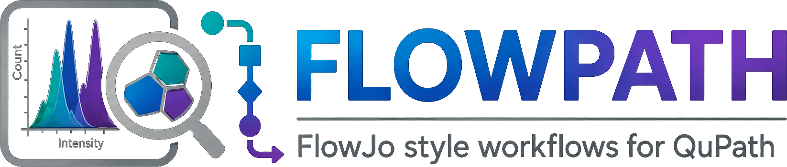
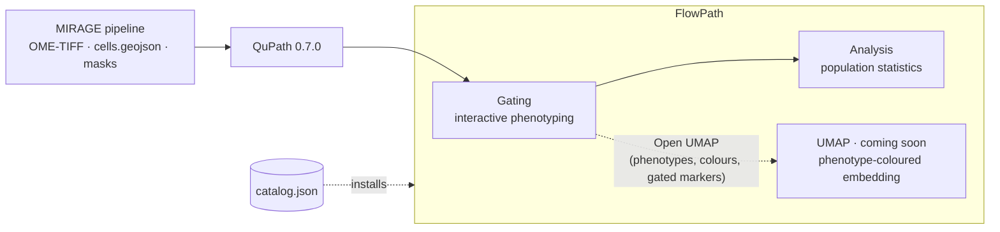

---
hide:
  - navigation
  - toc
---

**FlowJo-style workflows for QuPath**

A [QuPath](https://qupath.github.io/) 0.7.0 extension that turns multiplexed
imaging into living, clickable biology — gate cells into named phenotypes, read
the population statistics for every branch, and export them. FlowPath picks up
where the [MIRAGE](https://mirage-pipeline.readthedocs.io/) pipeline leaves off.
UMAP exploration of those same phenotypes is coming in a future release.

[:material-rocket-launch: Install](installation.md){ .md-button .md-button--primary }
[:material-walk: How to use](usage.md){ .md-button }
[:fontawesome-brands-github: GitHub](https://github.com/sceriff0/flowpath){ .md-button }

## What FlowPath is

FlowPath brings the muscle-memory of **flow cytometry** — gating populations,
counting them, comparing their shares — *inside* QuPath, on **multiplexed tissue
imaging** (CODEX, MIBI, mIF). You segment and quantify cells once, then phenotype
them interactively without leaving the viewer.

It works on one shared object — **QuPath detections carrying per-marker
measurements** — and gives you these views onto it:

| View | Role | One line |
|---|---|---|
| **Gating** | *phenotype* | Gate detections into named populations with a live hierarchical tree. |
| **[Analysis](usage.md#step-3-read-the-numbers-in-the-analysis-window)** | *quantify* | Counts, percentages and density per population, at three nested scopes, with plots and a CSV export. |
| **UMAP** *(coming in a future release)* | *explore* | Embed your gated markers in 2D, coloured by the phenotypes you just built, and lasso clusters. |

!!! warning "UMAP is coming in a future release"
    UMAP exploration is not available in this version — the **Open UMAP** button
    is disabled and labelled *UMAP (coming soon)*, and ++ctrl+u++ does nothing.
    Where these docs describe the UMAP, they describe how it will work once it
    ships.

Gating is the way in. The UMAP will open from it and inherit the phenotyping —
the same cells, the same colours, the same markers:

!!! tip "Upgrading from GatingTree + qUMAP"
    FlowPath used to ship as two extensions. They are now one. Remove
    *FlowPath - GatingTree* and *FlowPath - qUMAP* under **Extensions → Manage
    extensions** before installing FlowPath — QuPath identifies extensions by
    name and will not treat FlowPath as an upgrade of either. Saved gate trees
    load unchanged. See [Installation](installation.md).

## Where MIRAGE fits

[MIRAGE](https://mirage-pipeline.readthedocs.io/) is a Nextflow pipeline that produces
FlowPath's inputs: a pyramidal **OME-TIFF**, a QuPath-native **`cells.geojson`**,
and labeled **segmentation masks**. It deliberately stops at *quantified cells* —
phenotyping and exploration are what FlowPath adds.

You don't need MIRAGE, though. FlowPath works with **any** source of detections
plus measurements — Cellpose or StarDist masks imported via
[AnnoMask](https://github.com/sceriff0/qupath-extension-annomask), or any GeoJSON
with per-marker measurements. MIRAGE is the reference upstream because the measurement
keys line up exactly (see [Usage → the data model](usage.md#the-data-model)).

## Get started

-   :material-download:{ .lg .middle } **Install FlowPath**

    ---

    Add one catalog URL in QuPath and install the extension in a couple of
    clicks.

    [:octicons-arrow-right-24: Installation](installation.md)

-   :material-walk:{ .lg .middle } **Run the workflow**

    ---

    From cells in QuPath to gated phenotypes to population statistics, end to
    end — plus the per-tool options.

    [:octicons-arrow-right-24: Usage](usage.md)

!!! note "FlowPath and MIRAGE are separate projects"
    FlowPath is an independent, MIT-licensed QuPath extension by
    [`sceriff0`](https://github.com/sceriff0).
    [MIRAGE](https://mirage-pipeline.readthedocs.io/) is the upstream Nextflow pipeline,
    with its own documentation. If you publish with them, please
    [cite both](citation.md).
