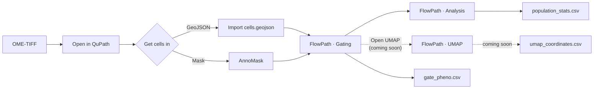

# Usage

The workflow in this release is three steps: **get cells into QuPath**, **gate
them into phenotypes**, then **read the population statistics** back out and
export them. A fourth step — **exploring those phenotypes in a UMAP** — is coming
in a future release, and is described here so you know what it will do. This page
walks through it end to end, then lists the options.

It assumes you've [installed FlowPath](installation.md) and have a multiplexed
OME-TIFF open in QuPath 0.7.0 — for example one produced by
[MIRAGE](https://mirage-pipeline.readthedocs.io/).



## The data model

Everything in FlowPath operates on one shared object: **QuPath detections that
carry per-marker measurements**. Both views read those measurements by key, and
they understand two conventions MIRAGE and AnnoMask write:

| Convention | Example key | Meaning |
|---|---|---|
| **Bare marker** | `CD45`, `DAPI` | Whole-cell mean intensity for that channel (the AnnoMask convention). |
| **Per-compartment** | `CD3: Nucleus: Median` | `"<MARKER>: <Compartment>: <Statistic>"`. MIRAGE emits Nucleus / Cytoplasm / Cell; FlowPath reads whichever the file has, and picks up a new one a pipeline adds. |

Because both sides speak the same key language, MIRAGE's output is plug-and-play:
no renaming, no remapping. If a dataset has **no** per-compartment keys (older
exports, or whole-cell-only masks), FlowPath falls back to whole-cell / Mean
automatically — nothing breaks.

!!! note "Which compartments and statistics you actually get"
    Two independent MIRAGE settings decide this, and FlowPath reads the answer from the
    file rather than assuming it:

    | MIRAGE setting | Default | Effect on the keys |
    |---|---|---|
    | `quantify_compartments` | **`true`** | Emits `Nucleus`, `Cytoplasm` and `Cell` per marker. Set `false` for a lean whole-cell-only run. |
    | `expanded_quantification` | **`false`** | Off: **`Median` only** — it is always computed. On (`--expanded`): adds `Mean` and `Sum` per compartment. |

    So a **default MIRAGE run gives you three compartments and one statistic, `Median`** —
    which is why FlowPath's gates default to Median too. The per-gate statistic dropdown
    will show just `Median` unless the run used `--expanded`, in which case `Mean` and
    `Sum` join it. You are only ever offered a combination that is in the file: asking for
    one that is not resolves to a missing key and reads as no data.

    The bare `<marker>` key is separate and always present — it is the whole-cell **mean**,
    which is why choosing whole-cell + Mean resolves to it.

    FlowPath does **not** hard-code this list. It discovers the vocabulary from the file
    and only understands its *shape*, so a statistic added on the MIRAGE side needs no
    change here — and, equally, a statistic the file does **not** carry is never offered.

!!! note "One index, two views"
    Gating and the UMAP share a single in-memory cell index. That is why the UMAP
    will open instantly on a slide the gating window has already loaded, and why
    editing a gate will recolour the embedding without recomputing it. (The UMAP
    itself is [coming in a future release](#explore-in-the-umap).)

## Step 1 — Get cells into QuPath

Open your pyramidal OME-TIFF. If it came from MIRAGE, DAPI is on channel 0 and the
rest are your markers. Then pick **one** of two equivalent on-ramps:

=== "On-ramp A — import GeoJSON"

    `File → Object data → Import objects` and choose MIRAGE's `cells.geojson`.
    Detections arrive with all marker measurements already attached — nothing
    else to do. Use this when you ran MIRAGE through its GeoJSON export.

=== "On-ramp B — import a mask with AnnoMask"

    Install [AnnoMask](https://github.com/sceriff0/qupath-extension-annomask)
    (a separate extension), then `Extensions → FlowPath - AnnoMask`
    (++ctrl+shift+m++). Point it at a labelled mask (`*_cell_mask.tif`), enable
    **intensity sampling**, and run. AnnoMask creates one detection per label and
    samples per-channel intensity using the **same bincount pass MIRAGE uses** —
    so the measurements are identical. Use this when all you have on disk is a
    labelled mask (MIRAGE, Cellpose, StarDist, or custom).

Either way you now have **detections carrying per-marker measurements**, ready to
gate.

## Step 2 — Gate and phenotype

Open `Extensions → FlowPath` (++ctrl+g++). Build a hierarchy of marker gates —
e.g. `CD45+ → CD3+ → CD8+ = "T cytotoxic"` — and cells recolour live as you move
thresholds.

1. Set **quality filters** to drop segmentation artefacts (min/max for area,
   eccentricity, solidity, perimeter, total intensity).
2. Add a **root gate** and pick a type — threshold (1D), quadrant (2D), polygon,
   rectangle, or ellipse.
3. For a threshold gate: pick a channel and drag the line on the histogram. For a
   2D gate: pick X/Y channels and draw the region on the scatter plot.
4. Add **child gates** to branches to sub-gate, and **name** leaf nodes
   ("T cytotoxic", "Tumor", "Stroma").
5. Open **Analysis** for per-population counts, percentages and density — see
   [Step 3](#step-3-read-the-numbers-in-the-analysis-window).

<figure class="screenshot" markdown>
{ .glightbox }
<figcaption>A multi-level gate tree; cells in the viewer recolour by phenotype in real time. <em>(placeholder)</em></figcaption>
</figure>

Your cells now carry **PathClasses** for the phenotypes you defined, and you can
export `flowpath.json` (the full gate hierarchy, reloadable and shareable) and
`gate_pheno.csv` (one row per cell, phenotype + per-marker ± status).

## Step 3 — Read the numbers in the Analysis window

Press **Analysis** in the gating toolbar. The window opens on the gating pass you
already have — there is nothing to run — and re-reads every subsequent pass for as
long as it stays open, so it tracks your gating live the way the viewer does.

It shows a **population table** under a row of pickers, with four plots below it.

### The pickers

| Picker | What it changes |
|---|---|
| **Scope** | Which cells the rows count — *Whole slide*, *All annotations*, or *Per annotation*. |
| **Denominator** | The branch every row's **% of Denominator** is reported against. With *(none)* that column stays blank — **% Total** is already the share of the whole scope. |
| **Root** | Which root gate the **Composition** plot breaks down. |
| **Population** | Which population the **By Region** and **By Scope** plots compare. |

The three scopes nest — *Per annotation* ⊆ *All annotations* ⊆ *Whole slide* — and
a slide with no annotations offers only *Whole slide*. The **Root** and
**Population** pickers label each entry with a `(root N)` suffix once there is more
than one root: two un-renamed root gates on the same channel produce **identically
named** populations, and the number is the only thing that tells them apart.

### The table

| Column | Meaning |
|---|---|
| **Root** | Which enabled root gate this population descends from, numbered from 1 in tree order. |
| **Population** | The gating route, e.g. `CD45+/CD8+`. |
| **Region** | The annotated region — at *Per annotation* scope only; blank otherwise. |
| **Count** | Every cell that landed in this population, quality-filtered cells included. |
| **Clean** | Cells that were not excluded: not quality-filtered, not outlier-clipped, and inside the annotation filter when it is on. **This is the number the gate tree shows.** |
| **% Parent** | Share of the parent branch. |
| **% Total** | Share of every cell in the scope. |
| **% of Denominator** | Share of the branch chosen in **Denominator**. |
| **Density** | Cells per mm² — the row's **Count**, over the region's *effective* area. |

Click **Root**, **Count** or **Clean** to sort numerically. The percentage and
density columns are formatted text and deliberately **do not** offer a sort rather
than offering a lexicographic one that would put `100.0` above `20.0`.

!!! info "Count and Clean answer different questions — and the gap moves with the scope"
    **Count** is the raw total; **Clean** is what survived exclusion. At *Whole
    slide* the gap folds in **two** things: cells the quality filter dropped, *and*
    — when the annotation ROI filter is on — cells outside the annotations. At the
    two per-region scopes a cell outside the annotations belongs to no region and
    is never counted at all, so there the gap is quality filtering alone.

    That is why the Analysis window can report a larger **Count** than the gate
    tree shows for the same population. **Clean** is the column that always agrees
    with the tree, by construction.

!!! info "Density divides by *effective* area, not raw annotation area"
    The area under a population is the annotated geometry with the same two rules
    the cell assignment already applies: `Ignore*` annotations are **subtracted**,
    and overlapping include-regions resolve **first match wins**. Dividing by the
    raw ROI area instead would shrink the numerator while leaving the denominator
    alone, so density would read *low* exactly where you had been most careful
    about excluding artefact.

    An unknown or zero effective area reports as **blank**, never as `0` — a zero
    denominator gives an infinite density, which reads like an answer. *Whole slide*
    has no annotated area to divide by, so its density is blank too.

    The numerator is **Count**, not **Clean**. At the per-region scopes that is
    already region-restricted (a cell outside the annotations belongs to no region),
    so the two differ there only by quality filtering.

### The plots

| Tab | Shows |
|---|---|
| **Composition** | How **one** root gate's whole-slide population splits across its leaf phenotypes, largest first. |
| **By Region** | One population's count in every annotated region, on one shared axis — core vs margin, side by side. |
| **By Scope** | One population at all three nested scopes, so you can see how much of it your annotations actually cover. |
| **Marker Positivity** | Per marker: how much of the slide is positive, how much negative, and — as its own segment — how much was **never evaluated** against that marker. |

**Composition** shows one root at a time because each root's leaves already sum to
the whole population on their own; pooling leaves across two roots would sum the
bars to twice the true denominator. Use the **Root** picker to switch.

!!! tip "Ungated is not negative"
    A marker gated only under one branch — say `CD3` hanging off `CD45+` — never
    has its threshold applied to the cells that took the other branch. Those cells
    are not CD3-negative; nobody asked the question. **Marker Positivity** gives
    them their own segment, so a partially quantified panel is visible at a glance
    instead of being silently smoothed into "negative".

### Export

**Export CSV…** writes `population_stats.csv`. It carries **every scope and every
region** — not just the rows the table happens to be showing — against the
denominator currently chosen.

## Coming next — explore in the UMAP { #explore-in-the-umap }

!!! warning "UMAP is coming in a future release"
    UMAP exploration is not available in this version — the **Open UMAP** button
    is disabled and labelled *UMAP (coming soon)*, and ++ctrl+u++ does nothing.
    The rest of this section describes how it will work once it ships.

Opening the UMAP from the gating toolbar will hand it your phenotyping already —
there will be nothing to reconnect or re-select.

**What it inherits from your gates:**

- the same cells, already filtered by your quality and annotation settings;
- **point colours** taken straight from the gate tree's branch colours;
- a **legend** listing your populations with real counts and shares;
- a **feature selection** pre-ticked to the markers you actually gated on, in the
  compartment and statistic you gated them in — not all forty channels on the
  slide. This needs **at least two gated markers**: a UMAP cannot be computed over
  one, so a single first gate leaves the picker at everything-ticked rather than
  pre-selecting a set that could not be run. The empty state says which of the two
  you are looking at.

The workflow it will offer:

1. The **Cells** panel reports how many cells, how many phenotypes, and how many
   markers are selected, adjustable with **Features…**.
2. A quality preset under **Embedding** (Fast / Balanced / Best) feeds
   **Run UMAP**. Progress appears inline, under the button, with a Cancel beside
   it; the gating window stays usable throughout. **Run UMAP is greyed out** until
   at least two markers are ticked, and while a feature change is still being
   applied. The inputs lock for the duration of a run, so a preset or a marker
   cannot be changed out from under the computation in flight.
3. The status line reports the finished run. A run that had to degrade something
   says so there — see
   [what the warnings mean](#what-a-run-reports-about-itself) below.
4. Under **Colour**, **Phenotype** (the default) and **Marker** switch between the
   gate colours and one marker's expression across the embedding.
5. In the legend, **clicking a population hides it** — the fastest way to dig a
   rare population out from under a dominant one — and **hovering highlights** it
   in place.
6. Under **Select**, a **polygon** drawn around a cluster can be named and stored
   as a derived PathClass with **Tag Selection**.
7. **Export Data** writes `umap_coordinates.csv`.

<figure class="screenshot" markdown>
{ .glightbox }
<figcaption>A UMAP embedding coloured by the phenotypes assigned in the gating tree. <em>(placeholder — coming in a future release)</em></figcaption>
</figure>

!!! tip "Keeping both windows open"
    The UMAP is designed to stay open while you carry on gating: every gate edit
    re-pushes the phenotyping and the embedding recolours immediately — no
    recompute. Coherent populations landing as distinct islands will be a fast
    visual check on your gates, and watching a threshold split an island in real
    time the quickest way to find the right one.

## What you end up with

| File | From | Contents |
|---|---|---|
| `flowpath.json` | Gating | Gate hierarchy, thresholds, colours, QC settings |
| `gate_pheno.csv` | Gating | Per-cell phenotype + per-marker ± status |
| `population_stats.csv` | Analysis | Per-population counts, percentages, area and density — at all three scopes |
| `umap_coordinates.csv` | UMAP *(coming in a future release)* | Per-cell UMAP X/Y + phenotype |
| PathClasses | Gating (and the UMAP, once it ships) | Named populations stored on the QuPath objects |

Both per-cell files open with the **same identity block**, so they can be joined to each
other — and back to MIRAGE — on `label`:

```csv title="gate_pheno.csv"
cell_id,label,phenotype,centroid_x,centroid_y,centroid_x_px,centroid_y_px,area,perimeter,eccentricity,solidity,Out_of_annotation,Outlier,Unmeasured,region,CD45_raw,CD45_zscore,CD45_sign
0,17,T cytotoxic,6134.5990,2291.3830,18876.4892,7051.9477,65.5930,30.6559,0.5733,0.9412,False,False,False,Tumor,1591.1916,1.8420,+
```

```csv title="umap_coordinates.csv (coming in a future release)"
cell_id,label,phenotype,centroid_x,centroid_y,centroid_x_px,centroid_y_px,area,perimeter,eccentricity,solidity,population,umap_x,umap_y,CD45_raw,CD45_zscore
0,17,CD4+,6134.5990,2291.3830,18876.4892,7051.9477,65.5930,30.6559,0.5733,0.9412,Cluster A,-3.2415,1.8720,1591.1916,1.8420
```

The Analysis window's export is a different shape — one row per **population per
scope**, not one per cell:

```csv title="population_stats.csv"
scope,region,region_index,path,branch,gate_channel,depth,root_index,count,clean_count,parent_count,clean_parent_count,denominator_count,percent_of_parent,percent_of_total,percent_of_denominator,area_mm2,density_per_mm2
WHOLE_SLIDE,,-1,CD45+/CD8+,CD8+,CD8,1,0,4820,4611,10233,9902,0,47.1025,12.0418,,,
ANNOTATION_K,Tumor,0,CD45+/CD8+,CD8+,CD8,1,0,2140,2140,4380,4380,0,48.8584,10.9903,,3.1420,681.0948
ANNOTATION_K,Tumor,1,CD45+/CD8+,CD8+,CD8,1,0,915,915,2011,2011,0,45.4998,8.2100,,1.7730,516.0744
```

!!! info "`root_index` and `region_index` are what disambiguate a repeated name"
    `GateNode` names its branches from the channel alone, so two un-renamed root
    gates on one channel emit **byte-identical** `path` values — `root_index`
    (zero-based here, while the table's **Root** column is one-based) is the only
    column that separates them. `region_index` is the same problem one axis down:
    `RegionMask` names an unnamed annotation after its *classification*, so two
    annotations both classified `Tumor` both export as `region=Tumor`, as in the
    rows above. It is `-1` at the scopes that are not per-region.

    `scope` is written as the stable enum name (`WHOLE_SLIDE`, `ANNOTATION_ALL`,
    `ANNOTATION_K`), not the label the picker shows. A value FlowPath does not have
    is written as an **empty field**, not as `NaN` — hence the three trailing commas
    on the whole-slide row above, which has no annotated area and no chosen
    denominator.

!!! info "Units are in the names"
    `centroid_x` / `centroid_y` are **micrometres** — MIRAGE's `join_flowpath.py` inverts
    them as `x_px = centroid_x / pixel_size - 0.5`, so those two names are a fixed
    contract. `centroid_x_px` / `centroid_y_px` are the same positions in level-0 pixels,
    stated explicitly so you never have to invert the calibration yourself.

    `label` is the segmentation label, present whenever MIRAGE exported it. With it, the
    join back to a SpatialData store is exact; without it, `join_flowpath.py` falls back
    to a mutual-nearest centroid match.

    `Unmeasured` is **not** a third flavour of `Outlier`. It marks a cell that reached a
    gate with no measurement for it: no branch was assigned there, its phenotype stops at
    the last gate that could judge it, and it descends no further. `Outlier` means the
    opposite — measured, but extreme. `region` names the annotated region the cell fell
    in, and is written only when the annotation filter has regions to report.

## Options reference

### Gating

- **Gate types** — threshold (1D), quadrant (2D dual-threshold), polygon,
  rectangle, ellipse.
- **Per-gate compartment & statistic** — choose Nucleus / Cytoplasm / Cell and any
  statistic the export carries, per gate. Only combinations actually present in the file
  are offered.
- **Values** — a gate compares against a column that is **in the export**. On a MIRAGE
  run that means the column as measured, so there is nothing to choose and no selector
  appears; pick *what* to read with the compartment and statistic dropdowns instead.

    FlowPath no longer offers a z-score of its own. It used to, computed over the cells
  currently loaded *and filtered* — which meant the same slider position was a different
  cut after you tightened a quality filter or drew a different ROI, and a threshold quoted
  in a methods section would not reproduce. If a pipeline ever exports a pre-standardised
  column, that is a real column and appears here as its own labelled option.

    Gate trees saved under the old mode still load: the threshold is converted back into
  the column's own units on open, so the gate keeps the cells it had.

- **Quality filters** — pre-gating QC with a min + max per morphology measurement
  **your export actually carries**. A MIRAGE run gives you area, eccentricity, perimeter,
  solidity and both axis lengths; a whole-cell-only mask gives you fewer, and the rows you
  do not have are simply not shown rather than being sliders over missing data. Each
  slider spans its own column's observed range, and a measurement FlowPath has no name for
  gets a row like any other.
- **Outlier exclusion** — per-gate percentile clipping, with the scatter axis
  zooming to the clipped range.
- **Undo / Redo** — snapshot-based (++ctrl+z++ / ++ctrl+shift+z++); drag-and-drop
  to reorder gates between branches.

### Analysis

- **Scope** — *Whole slide*, *All annotations*, or *Per annotation*. They nest, and
  an unannotated slide offers only the first.
- **Denominator** — report every population against one chosen branch, in addition
  to the parent and whole-scope shares that are always there. *(none)* takes you
  back off it and blanks the column. **% of Denominator**
  renders blank both when no denominator is chosen and when the chosen branch holds
  no cells — neither is a question with a numeric answer, and showing `0.0` for the
  second would state a share of nothing as though it had been measured.
- **Root / Population pickers** — drive the **Composition** plot and the **By
  Region** / **By Scope** plots respectively. Both spell out `(root N)` once the
  tree has more than one root.
- **Plots** — Composition, By Region, By Scope, Marker Positivity; see
  [Step 3](#the-plots).
- **Export CSV…** — writes `population_stats.csv` with every scope and every
  region, against the denominator currently chosen. Enabled once there is a gating
  pass with at least one enabled root gate.

### UMAP

!!! warning "UMAP is coming in a future release"
    UMAP exploration is not available in this version — the **Open UMAP** button
    is disabled and labelled *UMAP (coming soon)*, and ++ctrl+u++ does nothing.
    The options below describe how it will work once it ships.

- **Quality presets** — Fast / Balanced / Best, or Custom to expose neighbours
  (`k`), epochs, subsampling mode and cell cap. Computed via the
  [SMILE](https://haifengl.github.io/) library.
- **Feature selection** — pre-seeded from your gates once you have gated **two or
  more** markers; every other marker on the slide stays available in the picker,
  just unticked. Unticking a marker **excludes it from the embedding** — the
  computation reads only the ticked columns — so it is the lever for trimming a
  40-plex down to the markers a question is actually about. **Run UMAP requires at
  least two ticked markers** and is disabled below that, and again for the moment
  it takes to apply a change.
- **Subsampling** — Auto / Off / Fixed, with stratified sampling that preserves
  phenotype proportions; large slides project the rest via weighted kNN, so every
  cell still gets coordinates.
- **Colour by** — phenotype (from the gate tree) or a single marker's expression,
  as z-score (blue-white-red) or raw intensity (viridis).
- **Interactive legend** — click a population to hide it, hover to highlight it,
  and read each one's share of the total.
- **Population tagging** — name + colour a polygon selection and store it as a
  derived PathClass; multiple tags coexist with coloured ring overlays.
- **Viewer link** — two-way selection between the embedding and the QuPath image
  viewer (selection only; it never changes classifications).
- **OOM protection** — memory is estimated before computing, with a warning if a
  dataset may run out.
- **Locked inputs during a run** — the presets, the feature picker and the
  subsampling controls are disabled while a computation is in flight, so what the
  result was computed from is what the panel was showing when you pressed Run.

#### What a run reports about itself { #what-a-run-reports-about-itself }

A UMAP that had to degrade something still produces a picture, and the picture
looks exactly like a clean one. So every successful run now says what it cost:
the **first finding on the status line**, the **whole report in the tooltip**
behind it. A run with nothing to report says so and stays green.

What can appear there:

- **Cells the projection could not place.** Held-out cells with no usable sampled
  neighbour are left at exactly `(0, 0)`, where they read as a real, tight cluster
  rather than as missing data. If you see a suspiciously dense blob at the origin,
  this is the line that tells you it is not one.
- **Markers no training cell carried.** Imputed with the mean of nothing, so each
  is a column of zeros contributing nothing to any distance — the embedding was
  effectively over fewer markers than you ticked.
- **Constant markers.** Known data, unlike the above, but a feature with no
  variance moves no distance.
- **The imputed cell, and the rows reweighted around it.** One node is detached
  from the neighbour graph so the layout starts from PCA rather than a spectral
  initialisation (see below); its position is imputed from its true neighbours,
  and the cells that listed it have their distance vectors rewritten. This is
  policy on every run under the spectral limit, so it is recorded as provenance
  rather than as a warning.
- **The subsample size**, when subsampling was applied — how much of the picture
  was optimised rather than projected.

!!! note "Layout initialisation"
    FlowPath always initialises the layout from **PCA**. The spectral alternative
    needs an ARPACK native library that has no `macosx-arm64` build, so a run that
    reached it failed outright. Because FlowPath now chooses, embeddings are
    reproducible across platforms — but coordinates for datasets of 10 000 cells
    or fewer differ from those produced by the earlier 2.x line.

| Cell count | Strategy | Expected time |
|---|---|---|
| < 10K | Direct computation | 2–5 s |
| 10K–50K | Direct with progress | 10–30 s |
| 50K–100K | Auto-subsampling recommended | 5–15 s |
| > 100K | Subsampling + kNN projection | 10–30 s |
