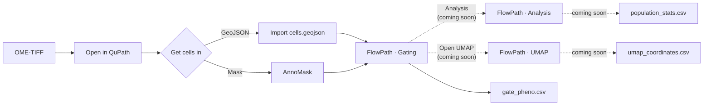

# Usage

The workflow in this release is two steps: **get cells into QuPath**, then **gate
them into phenotypes** and export them. Two further steps — **reading the
population statistics in the Analysis window** and **exploring those phenotypes
in a UMAP** — are coming in a future release, and are described here so you know
what they will do. This page walks through it end to end, then lists the
options.

It assumes you've [installed FlowPath](installation.md) and have a multiplexed
OME-TIFF open in QuPath 0.7.0 — for example one produced by
[MIRAGE](https://mirage-pipeline.readthedocs.io/).


```mermaid
flowchart LR
    A[OME-TIFF] --> Q[Open in QuPath]
    Q --> I{Get cells in}
    I -->|GeoJSON| G1[Import cells.geojson]
    I -->|Mask| AM[AnnoMask]
    G1 --> GT[FlowPath · Gating]
    AM --> GT
    GT -.->|"Analysis<br/>(coming soon)"| AN[FlowPath · Analysis]
    GT -.->|"Open UMAP<br/>(coming soon)"| UM[FlowPath · UMAP]
    GT --> CSV1[gate_pheno.csv]
    AN -.->|coming soon| CSV3[population_stats.csv]
    UM -.->|coming soon| CSV2[umap_coordinates.csv]
```

## The data model

Everything in FlowPath operates on one shared object: **QuPath detections that
carry per-marker measurements**. Both views read those measurements by key, and
they understand two conventions MIRAGE and AnnoMask write:

| Convention | Example key | Meaning |
|---|---|---|
| **Bare marker** | `CD45`, `DAPI` | Whole-cell mean intensity for that channel (the AnnoMask convention). |
| **Per-compartment** | `CD3: Nucleus: Median` | `"<MARKER>: <Compartment>: <Statistic>"`. MIRAGE emits Nucleus / Cytoplasm / Cell; FlowPath reads whichever the file has, and picks up a new one a pipeline adds. |

Because both sides speak the same key language, MIRAGE's output is plug-and-play:
no renaming, no remapping. If a dataset has **no** per-compartment keys (older
exports, or whole-cell-only masks), FlowPath falls back to whole-cell / Mean
automatically — nothing breaks.

!!! note "Which compartments and statistics you actually get"
    Two independent MIRAGE settings decide this, and FlowPath reads the answer from the
    file rather than assuming it:

    | MIRAGE setting | Default | Effect on the keys |
    |---|---|---|
    | `quantify_compartments` | **`true`** | Emits `Nucleus`, `Cytoplasm` and `Cell` per marker. Set `false` for a lean whole-cell-only run. |
    | `expanded_quantification` | **`false`** | Off: **`Median` only** — it is always computed. On (`--expanded`): adds `Mean` and `Sum` per compartment. |

    So a **default MIRAGE run gives you three compartments and one statistic, `Median`** —
    which is why FlowPath's gates default to Median too. The per-gate statistic dropdown
    will show just `Median` unless the run used `--expanded`, in which case `Mean` and
    `Sum` join it. You are only ever offered a combination that is in the file: asking for
    one that is not resolves to a missing key and reads as no data.

    The bare `<marker>` key is separate and always present — it is the whole-cell **mean**,
    which is why choosing whole-cell + Mean resolves to it.

    FlowPath does **not** hard-code this list. It discovers the vocabulary from the file
    and only understands its *shape*, so a statistic added on the MIRAGE side needs no
    change here — and, equally, a statistic the file does **not** carry is never offered.

!!! note "One index, two views"
    Gating and the UMAP share a single in-memory cell index. That is why the UMAP
    will open instantly on a slide the gating window has already loaded, and why
    editing a gate will recolour the embedding without recomputing it. (The UMAP
    itself is [coming in a future release](#explore-in-the-umap).)

## Step 1 — Get cells into QuPath

Open your pyramidal OME-TIFF. If it came from MIRAGE, DAPI is on channel 0 and the
rest are your markers. Then pick **one** of two equivalent on-ramps:

=== "On-ramp A — import GeoJSON"

    `File → Object data → Import objects` and choose MIRAGE's `cells.geojson`.
    Detections arrive with all marker measurements already attached — nothing
    else to do. Use this when you ran MIRAGE through its GeoJSON export.

=== "On-ramp B — import a mask with AnnoMask"

    Install [AnnoMask](https://github.com/sceriff0/qupath-extension-annomask)
    (a separate extension), then `Extensions → FlowPath - AnnoMask`
    (++ctrl+shift+m++). Point it at a labelled mask (`*_cell_mask.tif`), enable
    **intensity sampling**, and run. AnnoMask creates one detection per label and
    samples per-channel intensity using the **same bincount pass MIRAGE uses** —
    so the measurements are identical. Use this when all you have on disk is a
    labelled mask (MIRAGE, Cellpose, StarDist, or custom).

=== "On-ramp C — a whole MIRAGE run at once"

    In the FlowPath window, click **New project from MIRAGE…** and pick MIRAGE's `--outdir`.
    FlowPath finds every patient (`<outdir>/<patient>/pyramid/pyramid.ome.tiff`), lists them
    before writing anything, and builds a QuPath project with one image per patient, its cells
    imported from `geojson/export/` and saved. Choose **Cell + nucleus outlines**
    (`cells.geojson`) or **Whole-cell outline only** (`cells_wholecell.geojson`, lighter) — the
    measurements are the same. The project goes in `<outdir>/qupath_project` unless you pick
    another folder; picking a folder that already holds a project adds only the patients it
    lacks. Use this to start [gating many slides](#gating-many-slides).

Either way you now have **detections carrying per-marker measurements**, ready to
gate.

## Step 2 — Gate and phenotype

Open `Extensions → FlowPath` (++ctrl+g++). Build a hierarchy of marker gates —
e.g. `CD45+ → CD3+ → CD8+ = "T cytotoxic"` — and cells recolour live as you move
thresholds.

1. Set **quality filters** to drop segmentation artefacts (min/max for area,
   eccentricity, solidity, perimeter, total intensity).
2. Add a **root gate** and pick a type — threshold (1D), quadrant (2D), polygon,
   rectangle, or ellipse.
3. For a threshold gate: pick a channel and drag the line on the histogram. For a
   2D gate: pick X/Y channels and draw the region on the scatter plot.
4. Add **child gates** to branches to sub-gate, and **name** leaf nodes
   ("T cytotoxic", "Tumor", "Stroma").
5. *(Coming in a future release.)* Open **Analysis** for per-population counts,
   percentages and density — see
   [Step 3](#step-3-read-the-numbers-in-the-analysis-window).

<figure class="screenshot" markdown>
{ .glightbox }
<figcaption>A multi-level gate tree; cells in the viewer recolour by phenotype in real time. <em>(placeholder)</em></figcaption>
</figure>

Your cells now carry **PathClasses** for the phenotypes you defined, and you can
export `flowpath.json` (the full gate hierarchy, reloadable and shareable) and
`gate_pheno.csv` (one row per cell, phenotype + per-marker ± status).

## Gating many slides { #gating-many-slides }

Open a **project** with two or more images (a MIRAGE run becomes one with **New project from
MIRAGE…**, see [Step 1](#step-1-get-cells-into-qupath)) and the gate editor grows two controls above the
histogram or scatter plot — **This slide / All slides** — plus a **Correct staining** checkbox
and, under the gate tree, a **cohort card** that opens the **Cohort window**. Everything below assumes a
project is open; with none open, or a project of one image, FlowPath behaves exactly as in
[Step 2](#step-2-gate-and-phenotype).

**The loop:** confirm a **reference slide** (FlowPath suggests one; see below), build the tree
on it — every threshold you set is a raw number on that slide, exactly as it always was. Switch
to **All slides** and set each threshold against every slide's distribution at once. Work
through the ⚠ cells of the **Cohort window**. Then **Run on all slides** for a combined
population table, one phenotype CSV per slide, and a manifest of the exact threshold used on
every slide.

### Reference slide

FlowPath never picks the reference for you. Until you confirm one, the cohort card reads
**Pick a reference slide — suggested: *\<slide\>*** with a **Choose reference…** button, the
status line says **No reference slide**, and correction is off: every slide uses the tree's own
numbers. Gating still works meanwhile.

The **suggestion** is the most central slide of the cohort: among the slides where every gated
marker shows a clear negative peak (and at least the usual number of peaks), the one whose
staining distributions are, summed over the gated markers, closest to all the others. The
Cohort window's banner says why ("the most central slide on 11 of 12 gated columns"), and adds
a note when a marker's most central slide is a different one, when a slide lacks a peak most
slides have, or when no slide has a clear negative peak for a marker (that marker is then not
corrected). With fewer than three suitable slides there is no suggestion — pick the one you know
best.

To confirm, click **Use *\<slide\>*** in the banner, or ☆ on any row of the grid:

- With **no gates** yet, that slide becomes the reference directly.
- With gates already drawn, FlowPath first asks **which slide these gates were drawn on**
  (pre-filled with the open slide): that slide becomes the reference, because the numbers on the
  tree are its numbers. Switching to the suggested slide afterwards is an ordinary change.

**Changing** an existing reference (☆ on another row, or **Use *\<slide\>***) asks once —
*"Thresholds will be re-expressed on \<slide\>. Ctrl+Z undoes it."* — and rebases every gate's
numbers onto the new slide. Confirming and changing are each **one undo step**.

A tree you **load** keeps whatever reference it names; a tree that names none stays without one
until you confirm one. A tree loaded into a project that does not contain its reference slide
falls back to using the reference numbers as raw thresholds, with correction disabled and a
status-bar message — nothing is silently recomputed.

### All slides

**All slides** draws every sampled slide's distribution for the shown gate on the same axes,
each aligned into the reference slide's units, under one threshold line. If the correction
worked, the curves line up — a genuinely single threshold applies to all of them. A slide whose
curve does not line up is visibly wrong before any ⚠ in the Cohort window says so: usually a
slide with an unusual stain, or one with no clear negative population to align on.

### Correct staining

**Correct staining** is on by default for a new gate and off for a gate loaded from a tree saved
before this version, so opening an old tree never changes a number. When it is on, each slide ×
marker column is aligned to the reference slide with **UniFORM's shift** (Wang et al. 2025
`[FULL: main text, STAR Methods and code; supplement Tables S1–S5 and Fig S5 not read]`): one
multiplicative factor per slide and marker, found by sliding the slide's log-intensity histogram
along the reference's until they overlap best. It is a shift only, never a stretch, and it does
not match percentiles (percentile matching assumes every slide has the same % positive, which is
exactly what gating is measuring). When the automatic shift looks wrong, pick the slide's
negative peak on the histogram and the correction uses that landmark instead. Picked peaks are
stored as raw intensities in the project image metadata (`flowpath.cohort.peak.<column>`), not in the gate tree file.
A landmark needs the reference's negative peak too, found automatically or picked on the
reference. When a pick cannot be used, the slide is left uncorrected and its cell asks for a look
with the reason: **∅ No negative peak** when the reference has no peak to pair it with (pick the
reference's peak), **# Too few cells** when the pick — the slide's or the reference's — lies
outside the current log scale (below 1 on ln, for example after switching from ln(x+1)). **Use
automatic** and **Use automatic (reference)** clear a stored pick even when it cannot be drawn on
the current scale.

Landmarks are found on each slide's **clean** cells — those passing the tree's quality filter
and, when it is on, the annotation (ROI) filter — the same cells the gate tree counts as clean.
Change the quality filter or switch the ROI filter and the landmarks, the review, the marker
rules, the All slides curves and the crops all follow it. The log scale (natural log of
values of at least 1 by default; an optional ln(x+1) per project, a documented departure from
UniFORM) is stored in `<project>/flowpath/cohort-settings.json` and is the same for every slide, so the result does
not depend on which slides were sampled first, or on whether the alignment cache existed.

For a threshold or quadrant gate the cut moves exactly with the correction. For a polygon
rectangle or ellipse gate, a rectangle or polygon is corrected exactly (every vertex or bound
mapped individually); an ellipse is carried by its bounding box, so it and a polygon's edges
between vertices bend slightly under a non-linear correction — both are approximate near their
outline, stated in the editor's own tooltip.

### The Cohort window

The **cohort card** under the gate tree shows one status line and two buttons, **Open cohort…**
(or **Choose reference…** while there is no reference) and **Run on all slides…**. The status
line summarises the cohort, e.g. `38/40 sampled · 5 to review · Ready to run`. **Ready to run**
appears only when **Run on all slides** can actually start; otherwise the line says why not —
`Sampling…`, `Running…`, `Not ready to run` (FlowPath is busy, or the tree has no enabled
gate), `No reference slide`, or `Tree from another project`.

**Open cohort…** opens a separate window: the reference banner at the top, then a grid with **one
row per slide and one column per gate** (in tree order), then the selected cell's detail. Each
row starts with ☆/★ (★ is the reference), the slide's name and its sampled cell count; rows
still **sampling**, whose sampling **failed**, or that are **excluded** are greyed and labelled.
Each cell carries one mark:

| Mark | Meaning |
|---|---|
| ✓ | corrected, nothing to review |
| ⚠ | needs a look (the reasons are in the detail) |
| ↷ | you answered **Looks right**, and the applied value has not changed since |
| ✎ | adjusted: a manual value for this slide |
| ⊘ | skipped: this gate does not judge this slide's cells |
| — | the marker is not measured on this slide |
| = | not corrected on this slide |

**Only ⚠** hides the rows with nothing to review.

A ⚠ cell is flagged for one of these reasons:

| Reason shown | Why it's flagged |
|---|---|
| "No clear negative peak — not corrected" | The slide has no landmark to align this column on. Not shown while the reference slide is missing from the project, since nothing is corrected then. |
| "Staining *N*× brighter/dimmer than typical" (or "contrast … higher/lower than typical") | This slide's alignment offset or stretch is far from the cohort's (median ± 3 MAD). |
| "Threshold sits on a peak, not in a valley" | The applied threshold falls on a density peak in the parent population, not between two populations. |
| "Only *N* cells reach this gate" / "Only *N*% of cells reaching this gate are measured on *marker*" | Too few sampled cells reach this gate, or too few of them carry a measurement for it, to judge. |

Click a cell to see its detail: slide · gate, the reasons, the **reference → applied**
threshold, and — for a ⚠ cell — a **200 µm tissue crop** at the gate's boundary (the gate's
marker in green on a per-slide brightness range, DAPI in blue, boundary cells outlined in their
branch colour), so most cells are decided without opening the slide. **Adjust in editor** (or
++v++) opens the slide itself instead — this selects the gate, switches to **This slide**, and,
for a ⚠ cell, centres the viewer on the tissue where the gate decides and turns on the boundary
overlay (toggle it with ++b++). The overlay only paints; it never writes a `PathClass` and can
never dirty the slide's data file.

Answer a ⚠ cell with:

| Answer | Key | Records |
|---|---|---|
| **Looks right** | ++enter++ | The applied values are approved; the cell shows ↷ until they change. |
| **Adjust in editor** | drag the cut, then ++enter++ | A manual value for **this slide only**, in this slide's own units — the reference number, and every other slide, are untouched. |
| **Skip this gate** | ++s++ | This gate no longer judges this slide's cells; they stay `UNMEASURED`, never counted as negative. |

**Use cohort value** on a ↷, ✎ or ⊘ cell drops that slide's own setting for the gate, so it goes
back to the corrected reference value. ++n++ / ++p++ step to the next / previous ⚠ cell, ++esc++
returns to All slides. Every answer — however many drags it took — is **one undo step**. In the
main FlowPath window these keys act only while it has focus, since they share letters with
QuPath's own tool shortcuts.

A review is of a *number*: if the reference threshold (or the alignment) later moves and the
applied value changes, the item comes back on its own — there is nothing to invalidate by hand.

!!! note "Region gates in this release"
    Polygon, rectangle and ellipse gates offer **Looks right** and **Skip** in the Cohort window, but
    not **Adjust** — per-slide shapes for region gates are not supported yet. Their shapes are
    still corrected slide-by-slide when Correct staining is on; you just cannot hand-adjust one
    slide's shape independently.

### Cells per slide

The sample size used for alignment and review — default **20 000** cells per slide, `0` for
every cell — is a preference, editable in the Cohort window's footer. Changing it invalidates the
sample and re-samples in the background; alignments are cached in
`<project>/flowpath/alignment-cache.json` (safe to delete — it is entirely derived data and is
never part of undo). A slide's cached landmarks are reused only while its sample and the quality
and ROI filters they were found under are unchanged; deleting the cache reproduces the same
numbers.

### Marker rules — lineage marker

Tick **Lineage marker** on a threshold gate to add it to a second, automatic check: FlowPath
already knows the lineage your tree states, and turns it into a number per slide.

- **Implies** (automatic, from the tree shape): a child gate's positive branch implies its
  ancestor's branch it sits under. Example: `CD8+` sits under `CD3+`, so a slide where 14% of
  `CD8+` cells are `CD3−` (cohort typically 2%) is flagged on the `CD3` gate — "CD3 threshold may
  be too high".
- **Exclusive** (every pair of gates ticked **Lineage marker**): two lineage markers should not
  both be positive on the same cell. Example: `CD3+CD20+` at 6% on one slide (cohort 0.8%) flags
  both gates — "a threshold may be too low, or signal spills from neighbouring cells" — and, when
  the sample also carries the marker's `Nucleus` column and the violation rate computed there is
  under half the current one, the reason adds "— try Nucleus".

A slide is flagged only when its rate is above the cohort's median + 3 MAD, above 2% absolute,
and backed by at least 20 cells — real double positives (CD4+CD8+ T cells, touching-cell
doublets) exist, so rules compare against the cohort rather than zero. Rules only point at a
likely cause; nothing tunes a threshold to reduce the violation rate for you.

### Reviewing by gate

Right-click a gate's column header for **All look right for *\<gate\>***, or press
**Shift+Enter** with one of its cells selected: every ⚠ cell of that gate is answered **Looks
right**, in one undo step — the common case, once the aligned curves in **All slides** visibly
line up. Fixing a parent gate re-scores its descendants immediately, so drilling into one slide
is only needed when a curve alone cannot settle it.

Two gates with the same marker under one branch — what **Duplicate** makes — are told apart by a
number: the first keeps its plain path (`CD3+/CD8`), the second is `CD3+/CD8#2`, and its own
branches and children follow (`CD3+/CD8+#2/CD4`). That path is what the grid's columns, the
manifest's `gate_path` and `qc_summary.csv` show, so an answer always lands on the gate it names.

### Excluding a slide

Right-click a row for **Exclude *\<slide\>* from the cohort** (and **Include** to undo it). An
excluded slide is not sampled and plays no part in the suggestion, the alignment or the review;
its row is greyed. It is saved with the project (on the image entry, not in `flowpath.json`), so
it stays excluded after reopening, and it is not an undo step — toggle it again to reverse it.
**Run on all slides** still gates an excluded slide, uncorrected, and records it in
`qc_summary.csv` (`cohort_excluded`). Any answers you gave on it stay on the tree and come back
if you include it again; including a slide samples just that slide, and every other slide keeps
its sample. The reference slide cannot be excluded: pick another reference first. If the tree's
reference is excluded anyway (say, after an undo), correction is switched off and the window says
*Reference slide is excluded — include it or pick another reference*: include it again, and once
it is sampled you can switch to another reference.

### Run on all slides

The cohort card's **Run on all slides…** button gates every image in the project and writes, into a
folder you pick. It waits until sampling has finished — a run started mid-sampling would gate the
slides not yet sampled uncorrected. Its confirmation says how many review items are still open,
and names any slide whose sampling failed: those run on the tree's own numbers, uncorrected.

| File | Contents |
|---|---|
| `batch_populations.csv` | One header, every slide's population rows (same shape as the Analysis window's export, plus `image`). |
| `<image>_gate_pheno.csv` | One per slide — the same per-cell phenotype file [Step 2](#step-2-gate-and-phenotype) produces for the open slide. |
| `gating_manifest.csv` | One row per slide × gate × axis: the exact threshold applied and why. |

`gating_manifest.csv` columns:

| Column | Example |
|---|---|
| `image_id`, `image_name` | `a3f…`, `slide_07.ome.tiff` |
| `root_index`, `gate_path`, `axis` | `1`, `CD45+/CD3+/CD8`, `x` |
| `column` | `CD8: Cell: Median` |
| `reference_value`, `applied_value` | `412.0`, `538.6` |
| `source` | `reference` \| `corrected` \| `uncorrected` \| `manual` \| `skipped` |
| `ref_L1`, `ref_L2`, `slide_L1`, `slide_L2` | landmarks, raw intensities, blank if absent |
| `review`, `flags` | `ok` when the item is answered (Looks right at today's value, an Adjust, or a Skip), else blank; open problem flags as tokens (see below) |

The flag tokens are `peak-lock`, `no-negative-peak`, `cant-judge`, `otsu-discordance`,
`shift-outlier`, `below-range`, `marker-rule` and `on-peak`, in severity order.

This is what makes per-slide thresholds acceptable in a methods section: every difference
between slides is written down with its cause.

Phenotypes are also **written back into every slide's `.qpdata`** — every cell gets the
`PathClass` the live preview would give it under that slide's resolved tree — with one
exception: **the slide open in the viewer is never written behind QuPath's back.** It has
already been classified live under the same resolved tree; save it from QuPath as usual once
you're done, the same way you always have. Its `<image>_gate_pheno.csv` and population rows come
from its **last saved file**, like every other slide's, so they do not include edits made in
QuPath since that save — the run's report says so.

### Running headless

The same code runs from a QuPath Groovy script — on a cluster, say, with no viewer at all:

```groovy
import qupath.ext.flowpath.batch.FlowPathBatch

FlowPathBatch.run(getProject(), new File('/path/tree.json'), new File('/path/out'))
```

or, from the script editor with an image open (so that image is gated but never written behind
QuPath's back):

```groovy
FlowPathBatch.run(getProject(), new File('/path/tree.json'), new File('/path/out'),
        getProjectEntry()?.getID())
```

!!! warning "Run the script once, never \"Run for project\""
    **Run for project** runs the script once *per image*, with each image open in turn — the
    whole project would then be gated once per image, and the image FlowPath sees as "open"
    would not be the one you meant. Use plain **Run**.

A run is **resumable**: `<outDir>/.flowpath-run.json` records, per slide, a fingerprint of the
resolved tree, the detections and the FlowPath version. A slide whose fingerprint matches and
whose outputs already exist is skipped, so a run interrupted at slide 37 of 40 picks up at 37
rather than starting over. The detection fingerprint hashes every cell's centroid but only a
bounded, deterministic sample of measurement values (the first 100 cells plus an even stride,
at most 1000) for a bounded cost on a very large slide — a re-quantified slide whose changes
fall entirely on unsampled cells' values can therefore still resume unchanged. To force a full
re-run, use a fresh output folder or delete `.flowpath-run.json`. Per-slide sanity issues are
recorded, never fatal to the run:

- fewer than 100 cells on the slide;
- the ROI filter is on but the slide has no area annotation (the whole slide was used instead);
- a gated channel is missing on the slide.

Every run also leaves a provenance bundle in `outDir`: `flowpath.json` (the tree exactly as run),
`gating_manifest.csv`, `run_info.txt` (FlowPath version, date, sample size, reference slide,
`log_scale`) and
`qc_summary.csv` — long format, one row per `(image_id, image_name, metric, subject, value)`,
with these metrics:

- `cells`, `cells_clean` — total and clean cell counts;
- `pct_quality_filtered`, `pct_outside_roi` — fractions excluded by the quality filter / ROI;
- `pct_unmeasured` (subject = gate path) — fraction a gate could not judge;
- `staining_factor` (subject = column) — the multiplicative factor that carries the reference
  threshold onto this slide; `alignment_kind` — `identity`, `auto` or `landmark`;
  `below_range_pct` — percent (0–100) of the slide's clean cells with a value that lie outside
  the log scale's domain (below 1 on ln, below 0 on ln(x + 1)), out of all those cells, inside
  the domain or not; these cells are corrected like the rest but not used to estimate the shift;
  `otsu_discordance_pct` — percent (0–100) of the slide's in-domain clean cells that its own Otsu
  threshold and the pooled cohort's Otsu threshold classify differently, on the corrected log
  values (Harris et al. 2022's discordance; the review flags it above 10%);
- `rule_violation_pct` (subject = the rule, e.g. `1:CD8+ => 1:CD3+`) — the marker-rule rate;
- `open_flags`, `reviewed_flags` — how many review (⚠) items were open / already reviewed;
- `sanity` (subject = the flag) — the per-slide sanity issues above.

## Step 3 — Read the numbers in the Analysis window

!!! warning "The Analysis window is coming in a future release"
    It is not available in this version — the **Analysis** button is disabled and
    labelled *Analysis (coming soon)*. Steps 1 and 2 above, and the per-cell
    `gate_pheno.csv` export, are unaffected. The rest of this section describes
    how the window will work once it ships.

Press **Analysis** in the gating toolbar. The window opens on the gating pass you
already have — there is nothing to run — and re-reads every subsequent pass for as
long as it stays open, so it tracks your gating live the way the viewer does.

It shows a summary line, then a **population table** under a row of pickers, then
four plots below it, each with its own controls sitting right underneath it rather
than in a shared strip above everything — a picker that visibly did nothing to the
tab you were looking at was the single worst intuitiveness problem in the earlier
layout.

The window's own title bar, and the summary line above the table, both name the
image the report is for, e.g. `slide_04.ome.tiff · 214,332 cells · 3 regions ·
189,201 in scope · 31 populations` — useful the moment you have more than one
Analysis window's screenshot to tell apart. While the **filter** box (below) is
narrowing the table, the last number switches to `N of M populations` so you can
tell at a glance that you are not looking at everything.

Within one running session, closing and reopening the Analysis window puts you
right back where you left it — same tab, scope, filter text and table selection.
Across a restart it remembers window size and position, the active tab, the
chosen scope, and every plot tab's own log/clip settings, not only whichever tab
happened to be open when you closed it.

### The pickers

| Picker | Lives | What it changes |
|---|---|---|
| **Scope** | Above the table | Which cells the rows count — *Whole slide*, *All annotations*, or *Per annotation*. |
| **Denominator** | Above the table | The branch every row's **% of Denominator** is reported against. With *(none)* that column stays blank — **% Total** is already the share of the whole scope. |
| **Root** | On the **Composition** tab | Which root gate that plot breaks down. |
| **Population** | On the **By Region** and **By Scope** tabs | Which population each plot compares. |

The three scopes nest — *Per annotation* ⊆ *All annotations* ⊆ *Whole slide* — and
a slide with no annotations offers only *Whole slide*. The **Root** and
**Population** pickers label each entry with a `(root N)` suffix once there is more
than one root: two un-renamed root gates on the same channel produce **identically
named** populations, and the number is the only thing that tells them apart.

### The table

| Column | Meaning |
|---|---|
| **Root** | Which enabled root gate this population descends from, numbered from 1 in tree order. |
| **Population** | The gating route, e.g. `CD45+/CD8+`. |
| **Region** | The annotated region — at *Per annotation* scope only; blank otherwise. |
| **Count** | Every cell that landed in this population, quality-filtered cells included. |
| **Clean** | Cells that were not excluded: not quality-filtered, not outlier-clipped, and inside the annotation filter when it is on. **This is the number the gate tree shows.** |
| **% Parent** | Share of the parent branch, over **Count**. |
| **% Parent (clean)** | The same share computed over **Clean** on both sides — clean count over clean parent count — so an excluded cell drops out of the denominator as well as the numerator. |
| **% Total** | Share of every cell in the scope, over **Count**. |
| **% Total (clean)** | The clean counterpart of **% Total**, the same clean/raw split **% Parent (clean)** makes. |
| **% of Denominator** | Share of the branch chosen in **Denominator**. |
| **Density** | Cells per mm² — the row's **Count**, over the region's *effective* area. |
| **Area (mm²)** | The region's own effective area, the denominator **Density** just divided by — so you never have to cross-reference the two by hand. |

Click any numeric column header — **Root**, **Count**, **Clean**, every
percentage column, **Density** and **Area (mm²)** — to sort numerically, in
either direction; a row with no value for the sorted column sorts to the bottom
regardless of direction, rather than jumping to the top on a descending sort.
The percentage, density and area columns used to be formatted text sorted
lexicographically, which put `100.0` above `20.0`; they now sort as the numbers
they display.

A **filter** box above the table narrows it to populations whose gating route or
region name contains what you type — clear it to see everything again. Select one
or more rows and **right-click → Copy** (or ++ctrl+c++) to copy them as
tab-separated text with a header row, ready to paste into a spreadsheet.

**Selecting a row selects its gate.** Clicking a population in the table
highlights the matching gate in the tree on the left, and the reverse: selecting a
gate in the tree selects its row here, if the current scope and filter are showing
it. Selecting a gate in the tree also moves the **By Region** and **By Scope**
plots' own population picker to match, not only the table row — so switching to
either comparison tab after picking a gate shows that same population already
selected, rather than whatever it last had chosen.

!!! info "Count and Clean answer different questions — and the gap moves with the scope"
    **Count** is the raw total; **Clean** is what survived exclusion. At *Whole
    slide* the gap folds in **two** things: cells the quality filter dropped, *and*
    — when the annotation ROI filter is on — cells outside the annotations. At the
    two per-region scopes a cell outside the annotations belongs to no region and
    is never counted at all, so there the gap is quality filtering alone.

    That is why the Analysis window can report a larger **Count** than the gate
    tree shows for the same population. **Clean** is the column that always agrees
    with the tree, by construction.

!!! info "Density divides by *effective* area, not raw annotation area"
    The area under a population is the annotated geometry with the same two rules
    the cell assignment already applies: `Ignore*` annotations are **subtracted**,
    and overlapping include-regions resolve **first match wins**. Dividing by the
    raw ROI area instead would shrink the numerator while leaving the denominator
    alone, so density would read *low* exactly where you had been most careful
    about excluding artefact.

    An unknown or zero effective area reports as **blank**, never as `0` — a zero
    denominator gives an infinite density, which reads like an answer. *Whole slide*
    has no annotated area to divide by, so its density is blank too.

    The numerator is **Count**, not **Clean**. At the per-region scopes that is
    already region-restricted (a cell outside the annotations belongs to no region),
    so the two differ there only by quality filtering.

### The plots

| Tab | Shows |
|---|---|
| **Composition** | How **one** root gate's whole-slide population splits across its leaf phenotypes, largest first. |
| **By Region** | One population's count in every annotated region, on one shared axis — core vs margin, side by side. |
| **By Scope** | One population at all three nested scopes, so you can see how much of it your annotations actually cover. |
| **Marker Positivity** | Per marker: how much of the slide is positive, how much negative, and — as its own segment — how much was **never evaluated** against that marker. |

**Composition** shows one root at a time because each root's leaves already sum to
the whole population on their own; pooling leaves across two roots would sum the
bars to twice the true denominator. Use the **Root** picker to switch.

!!! tip "Ungated is not negative"
    A marker gated only under one branch — say `CD3` hanging off `CD45+` — never
    has its threshold applied to the cells that took the other branch. Those cells
    are not CD3-negative; nobody asked the question. **Marker Positivity** gives
    them their own segment, so a partially quantified panel is visible at a glance
    instead of being silently smoothed into "negative".

Hover a bar on any plot to read its underlying numbers in a tooltip. On
**Composition**, **By Region** and **By Scope**, clicking a bar selects that
population in the table and its gate in the tree, the same two-way link the
table itself has. **Marker Positivity** is the exception: its bars are pooled
across every gate node that used a marker, so no single population can name what
was clicked — hovering still shows the numbers, but clicking selects nothing.

The plots follow QuPath's own light/dark theme automatically. That theme is only
re-read when a plot is re-parented into a fresh window, so if you switch QuPath's
theme while the Analysis window is open, its plots keep the colours they were
drawn with until you close and reopen the window — nothing repaints them in
place.

#### Log scale and clipping outliers

Underneath each plot, two independent controls fix the same complaint from
opposite directions: a gated slide routinely has one enormous population next to
several tiny ones, and a linear axis scaled to the biggest bar makes the small
ones invisible.

- **Log scale** — switches that plot's Y axis to a logarithmic one, so a
  214,000-cell bar and a 3-cell bar are both readable at once.
- **Clip outliers**, with a percentile spinner (50–100, default 95) — caps the
  axis at that percentile of the plot's own bar values instead of the true
  maximum, so the *typical* bars use the space a handful of extreme ones would
  otherwise dominate. A bar taller than the cap is never silently cut off: it
  draws to the top of the axis and carries a small axis-break mark, and a
  "— top values clipped" note appears next to the toggle whenever the last draw
  actually clipped something (a percentile that lands on the data's own maximum
  changes nothing, and the note stays off for it).

Both toggles are **per plot and independently combinable** — turn log scale on
for Composition without it following you to Marker Positivity, or run log and
clip together on the same plot when one population dwarfs the rest *and* a few
outliers within it dwarf each other.

### Export

The **Export ▾** menu above the table covers both the table and whichever plot
tab you currently have open:

| Item | Writes |
|---|---|
| **Copy plot to clipboard** | A raster image of the **currently selected plot tab**, ready to paste. |
| **Plot as image…** | One save dialog offering both **SVG** and **PNG** (at 2×) as extension choices for the **currently selected plot tab** — pick either and FlowPath writes that format from the same drawing routine that painted the screen. |
| **Plot data as CSV…** | The numbers behind the **currently selected plot tab**. |
| **Population table as CSV…** | `population_stats.csv` — **every scope and every region**, not just the rows the table happens to be showing, against the denominator currently chosen. |

## Coming next — explore in the UMAP { #explore-in-the-umap }

!!! warning "UMAP is coming in a future release"
    UMAP exploration is not available in this version — the **Open UMAP** button
    is disabled and labelled *UMAP (coming soon)*, and ++ctrl+u++ does nothing.
    The rest of this section describes how it will work once it ships.

Opening the UMAP from the gating toolbar will hand it your phenotyping already —
there will be nothing to reconnect or re-select.

**What it inherits from your gates:**

- the same cells, already filtered by your quality and annotation settings;
- **point colours** taken straight from the gate tree's branch colours;
- a **legend** listing your populations with real counts and shares;
- a **feature selection** pre-ticked to the markers you actually gated on, in the
  compartment and statistic you gated them in — not all forty channels on the
  slide. This needs **at least two gated markers**: a UMAP cannot be computed over
  one, so a single first gate leaves the picker at everything-ticked rather than
  pre-selecting a set that could not be run. The empty state says which of the two
  you are looking at.

The workflow it will offer:

1. The **Cells** panel reports how many cells, how many phenotypes, and how many
   markers are selected, adjustable with **Features…**.
2. A quality preset under **Embedding** (Fast / Balanced / Best) feeds
   **Run UMAP**. Progress appears inline, under the button, with a Cancel beside
   it; the gating window stays usable throughout. **Run UMAP is greyed out** until
   at least two markers are ticked, and while a feature change is still being
   applied. The inputs lock for the duration of a run, so a preset or a marker
   cannot be changed out from under the computation in flight.
3. The status line reports the finished run. A run that had to degrade something
   says so there — see
   [what the warnings mean](#what-a-run-reports-about-itself) below.
4. Under **Colour**, **Phenotype** (the default) and **Marker** switch between the
   gate colours and one marker's expression across the embedding.
5. In the legend, **clicking a population hides it** — the fastest way to dig a
   rare population out from under a dominant one — and **hovering highlights** it
   in place.
6. Under **Select**, a **polygon** drawn around a cluster can be named and stored
   as a derived PathClass with **Tag Selection**.
7. **Export Data** writes `umap_coordinates.csv`.

<figure class="screenshot" markdown>
{ .glightbox }
<figcaption>A UMAP embedding coloured by the phenotypes assigned in the gating tree. <em>(placeholder — coming in a future release)</em></figcaption>
</figure>

!!! tip "Keeping both windows open"
    The UMAP is designed to stay open while you carry on gating: every gate edit
    re-pushes the phenotyping and the embedding recolours immediately — no
    recompute. Coherent populations landing as distinct islands will be a fast
    visual check on your gates, and watching a threshold split an island in real
    time the quickest way to find the right one.

## What you end up with

| File | From | Contents |
|---|---|---|
| `flowpath.json` | Gating | Gate hierarchy, thresholds, colours, QC settings |
| `gate_pheno.csv` | Gating | Per-cell phenotype + per-marker ± status |
| `population_stats.csv` | Analysis *(coming in a future release)* | Per-population counts, percentages, area and density — at all three scopes |
| `umap_coordinates.csv` | UMAP *(coming in a future release)* | Per-cell UMAP X/Y + phenotype |
| PathClasses | Gating (and the UMAP, once it ships) | Named populations stored on the QuPath objects |

Both per-cell files open with the **same identity block**, so they can be joined to each
other — and back to MIRAGE — on `label`:

```csv title="gate_pheno.csv"
cell_id,label,phenotype,centroid_x,centroid_y,centroid_x_px,centroid_y_px,area,perimeter,eccentricity,solidity,Out_of_annotation,Outlier,Unmeasured,region,CD45_raw,CD45_sign
0,17,T cytotoxic,6134.5990,2291.3830,18876.4892,7051.9477,65.5930,30.6559,0.5733,0.9412,False,False,False,Tumor,1591.1916,+
```

```csv title="umap_coordinates.csv (coming in a future release)"
cell_id,label,phenotype,centroid_x,centroid_y,centroid_x_px,centroid_y_px,area,perimeter,eccentricity,solidity,population,umap_x,umap_y,CD45_raw,CD45_zscore
0,17,CD4+,6134.5990,2291.3830,18876.4892,7051.9477,65.5930,30.6559,0.5733,0.9412,Cluster A,-3.2415,1.8720,1591.1916,1.8420
```

The Analysis window's export — coming in a future release — is a different shape:
one row per **population per scope**, not one per cell:

```csv title="population_stats.csv"
scope,region,region_index,path,branch,gate_channel,depth,root_index,count,clean_count,parent_count,clean_parent_count,denominator_count,percent_of_parent,percent_of_total,percent_of_denominator,percent_of_clean_parent,percent_of_clean_total,area_mm2,density_per_mm2
WHOLE_SLIDE,,-1,CD45+/CD8+,CD8+,CD8,1,0,4820,4611,10233,9902,0,47.1025,12.0418,,46.5663,12.6941,,
ANNOTATION_K,Tumor,0,CD45+/CD8+,CD8+,CD8,1,0,2140,2140,4380,4380,0,48.8584,10.9903,,48.8584,10.9903,3.1420,681.0948
ANNOTATION_K,Tumor,1,CD45+/CD8+,CD8+,CD8,1,0,915,915,2011,2011,0,45.4998,8.2100,,45.4998,8.2100,1.7730,516.0744
```

!!! info "`root_index` and `region_index` are what disambiguate a repeated name"
    `GateNode` names its branches from the channel alone, so two un-renamed root
    gates on one channel emit **byte-identical** `path` values — `root_index`
    (zero-based here, while the table's **Root** column is one-based) is the only
    column that separates them. `region_index` is the same problem one axis down:
    `RegionMask` names an unnamed annotation after its *classification*, so two
    annotations both classified `Tumor` both export as `region=Tumor`, as in the
    rows above. It is `-1` at the scopes that are not per-region.

    `scope` is written as the stable enum name (`WHOLE_SLIDE`, `ANNOTATION_ALL`,
    `ANNOTATION_K`), not the label the picker shows. A value FlowPath does not have
    is written as an **empty field**, not as `NaN` — the whole-slide row above has
    no chosen denominator (`percent_of_denominator` is blank) and, being *Whole
    slide*, no annotated area to divide by either (`area_mm2` and
    `density_per_mm2` are the two trailing empty fields).

!!! info "`percent_of_clean_parent` / `percent_of_clean_total` are the clean counterparts"
    They divide `clean_count` by `clean_parent_count` / the scope's clean total,
    so an excluded cell drops out of the denominator as well as the numerator —
    unlike `percent_of_parent` / `percent_of_total`, which divide the raw `count`.
    The two per-region rows above happen to equal their raw counterparts because
    nothing was excluded in that example; the whole-slide row does not, because
    `count` (4820) and `clean_count` (4611) differ there.

!!! info "Units are in the names"
    `centroid_x` / `centroid_y` are **micrometres** — MIRAGE's `join_flowpath.py` inverts
    them as `x_px = centroid_x / pixel_size - 0.5`, so those two names are a fixed
    contract. `centroid_x_px` / `centroid_y_px` are the same positions in level-0 pixels,
    stated explicitly so you never have to invert the calibration yourself.

    `label` is the segmentation label, present whenever MIRAGE exported it. With it, the
    join back to a SpatialData store is exact; without it, `join_flowpath.py` falls back
    to a mutual-nearest centroid match.

    `Unmeasured` is **not** a third flavour of `Outlier`. It marks a cell that reached a
    gate with no measurement for it: no branch was assigned there, its phenotype stops at
    the last gate that could judge it, and it descends no further. `Outlier` means the
    opposite — measured, but extreme. `region` names the annotated region the cell fell
    in, and is written only when the annotation filter has regions to report.

## Options reference

### Gating

- **Gate types** — threshold (1D), quadrant (2D dual-threshold), polygon,
  rectangle, ellipse.
- **Per-gate compartment & statistic** — choose Nucleus / Cytoplasm / Cell and any
  statistic the export carries, per gate. Only combinations actually present in the file
  are offered.
- **Values** — a gate compares against a column that is **in the export**. On a MIRAGE
  run that means the column as measured, so there is nothing to choose and no selector
  appears; pick *what* to read with the compartment and statistic dropdowns instead.

    FlowPath no longer offers a z-score of its own. It used to, computed over the cells
  currently loaded *and filtered* — which meant the same slider position was a different
  cut after you tightened a quality filter or drew a different ROI, and a threshold quoted
  in a methods section would not reproduce. If a pipeline ever exports a pre-standardised
  column, that is a real column and appears here as its own labelled option.

    Gate trees saved under the old mode still load: as soon as the tree meets an image's
  cells, every gate's thresholds and shapes are converted back into the column's own units,
  so each gate keeps the cells it had — including gates you never open and trees you export
  straight away. A notification says how many gates were converted and names any that
  could not be: a gate on a column with no spread keeps its old numbers, and a gate on a
  channel this image does not carry stays in z-score units until the tree is opened on an
  image that has it.

- **Quality filters** — pre-gating QC with a min + max per morphology measurement
  **your export actually carries**. A MIRAGE run gives you area, eccentricity, perimeter,
  solidity and both axis lengths; a whole-cell-only mask gives you fewer, and the rows you
  do not have are simply not shown rather than being sliders over missing data. Each
  slider spans its own column's observed range, and a measurement FlowPath has no name for
  gets a row like any other.
- **Outlier exclusion** — per-gate percentile clipping, with the scatter axis
  zooming to the clipped range.
- **Undo / Redo** — snapshot-based (++ctrl+z++ / ++ctrl+shift+z++).
- **Reordering** — drag a gate onto any **branch** row to re-parent it there, subtree and
  all; drop it on the empty space below the tree to promote it back to a top-level gate.
  Only branches hold children, so a gate row is not a target, and neither is the branch
  the gate already hangs off nor any branch inside its own subtree. Those rows are marked
  as non-droppable while you drag over them and refuse the drop, leaving the tree exactly
  as it was. A completed move is one undo step.

### Analysis *(coming in a future release)*

- **Scope** — *Whole slide*, *All annotations*, or *Per annotation*. They nest, and
  an unannotated slide offers only the first.
- **Denominator** — report every population against one chosen branch, in addition
  to the parent and whole-scope shares that are always there. *(none)* takes you
  back off it and blanks the column. **% of Denominator**
  renders blank both when no denominator is chosen and when the chosen branch holds
  no cells — neither is a question with a numeric answer, and showing `0.0` for the
  second would state a share of nothing as though it had been measured.
- **Root / Population pickers** — sit under the **Composition** plot and the **By
  Region** / **By Scope** plots respectively, driving only that plot. Both spell
  out `(root N)` once the tree has more than one root.
- **Table filter, sort and copy** — the filter box narrows the table to
  populations whose route or region name matches what you type; every numeric
  column — **Root**, **Count**, **Clean**, every percentage column, **Density**
  and **Area (mm²)** — sorts numerically in either direction, blanks always
  last; a row selection copies as tab-separated text (right-click → Copy, or
  `Ctrl+C`).
- **Table ↔ tree selection** — selecting a table row selects its gate in the
  tree, and the reverse, so you can jump from a number to the threshold behind it.
- **Plots** — Composition, By Region, By Scope, Marker Positivity; see
  [Step 3](#the-plots). Each has its own **log scale** and **clip outliers**
  toggles (independently combinable, per plot) and reacts to **hover** (a
  tooltip of the underlying numbers); on Composition, By Region and By Scope,
  **click** also selects that population in the table and its gate in the tree —
  Marker Positivity's pooled bars have no single population to select.
- **Export ▾** — one menu above the table, whose plot items (copy to clipboard,
  save as SVG or PNG in one dialog at 2×, or save the plot's own numbers as CSV)
  act on whichever plot tab is currently selected. **Population table as
  CSV…**, in the same menu, writes `population_stats.csv` with every scope and
  every region, against the denominator currently chosen — not just the rows the
  table happens to be showing. Enabled once there is a gating pass with at least
  one enabled root gate.
- **Window memory** — a close/reopen within one session keeps the tab, scope,
  filter and selection exactly as left; across a restart, window geometry, the
  active tab, the chosen scope and all four plot tabs' log/clip settings are
  restored from preferences.

### UMAP

!!! warning "UMAP is coming in a future release"
    UMAP exploration is not available in this version — the **Open UMAP** button
    is disabled and labelled *UMAP (coming soon)*, and ++ctrl+u++ does nothing.
    The options below describe how it will work once it ships.

- **Quality presets** — Fast / Balanced / Best, or Custom to expose neighbours
  (`k`), epochs, subsampling mode and cell cap. Computed via the
  [SMILE](https://haifengl.github.io/) library.
- **Feature selection** — pre-seeded from your gates once you have gated **two or
  more** markers; every other marker on the slide stays available in the picker,
  just unticked. Unticking a marker **excludes it from the embedding** — the
  computation reads only the ticked columns — so it is the lever for trimming a
  40-plex down to the markers a question is actually about. **Run UMAP requires at
  least two ticked markers** and is disabled below that, and again for the moment
  it takes to apply a change.
- **Subsampling** — Auto / Off / Fixed, with stratified sampling that preserves
  phenotype proportions; large slides project the rest via weighted kNN, so every
  cell still gets coordinates.
- **Colour by** — phenotype (from the gate tree) or a single marker's expression,
  as z-score (blue-white-red) or raw intensity (viridis).
- **Interactive legend** — click a population to hide it, hover to highlight it,
  and read each one's share of the total.
- **Population tagging** — name + colour a polygon selection and store it as a
  derived PathClass; multiple tags coexist with coloured ring overlays.
- **Viewer link** — two-way selection between the embedding and the QuPath image
  viewer (selection only; it never changes classifications).
- **OOM protection** — memory is estimated before computing, with a warning if a
  dataset may run out.
- **Locked inputs during a run** — the presets, the feature picker and the
  subsampling controls are disabled while a computation is in flight, so what the
  result was computed from is what the panel was showing when you pressed Run.

#### What a run reports about itself { #what-a-run-reports-about-itself }

A UMAP that had to degrade something still produces a picture, and the picture
looks exactly like a clean one. So every successful run now says what it cost:
the **first finding on the status line**, the **whole report in the tooltip**
behind it. A run with nothing to report says so and stays green.

What can appear there:

- **Cells the projection could not place.** Held-out cells with no usable sampled
  neighbour are left at exactly `(0, 0)`, where they read as a real, tight cluster
  rather than as missing data. If you see a suspiciously dense blob at the origin,
  this is the line that tells you it is not one.
- **Markers no training cell carried.** Imputed with the mean of nothing, so each
  is a column of zeros contributing nothing to any distance — the embedding was
  effectively over fewer markers than you ticked.
- **Constant markers.** Known data, unlike the above, but a feature with no
  variance moves no distance.
- **The imputed cell, and the rows reweighted around it.** One node is detached
  from the neighbour graph so the layout starts from PCA rather than a spectral
  initialisation (see below); its position is imputed from its true neighbours,
  and the cells that listed it have their distance vectors rewritten. This is
  policy on every run under the spectral limit, so it is recorded as provenance
  rather than as a warning.
- **The subsample size**, when subsampling was applied — how much of the picture
  was optimised rather than projected.

!!! note "Layout initialisation"
    FlowPath always initialises the layout from **PCA**. The spectral alternative
    needs an ARPACK native library that has no `macosx-arm64` build, so a run that
    reached it failed outright. Because FlowPath now chooses, embeddings are
    reproducible across platforms — but coordinates for datasets of 10 000 cells
    or fewer differ from those produced by the earlier 2.x line.

| Cell count | Strategy | Expected time |
|---|---|---|
| < 10K | Direct computation | 2–5 s |
| 10K–50K | Direct with progress | 10–30 s |
| 50K–100K | Auto-subsampling recommended | 5–15 s |
| > 100K | Subsampling + kNN projection | 10–30 s |
